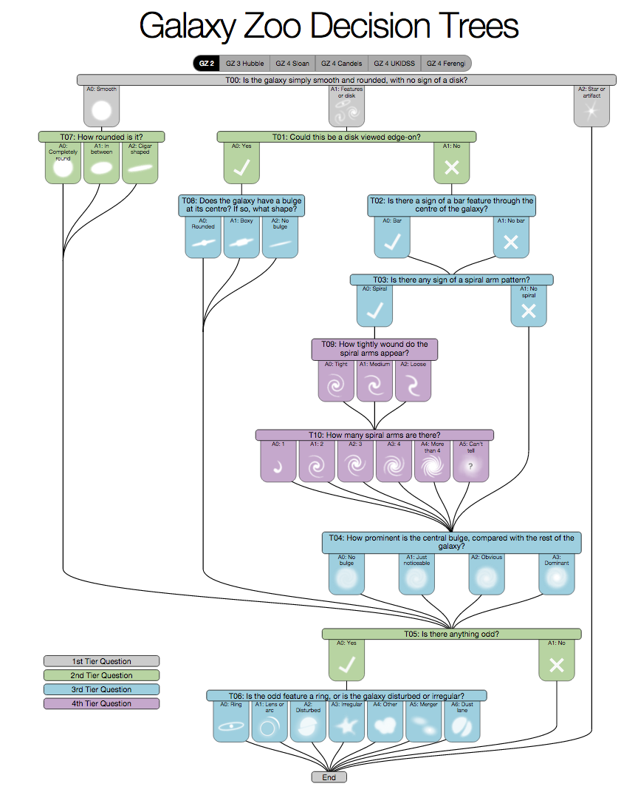
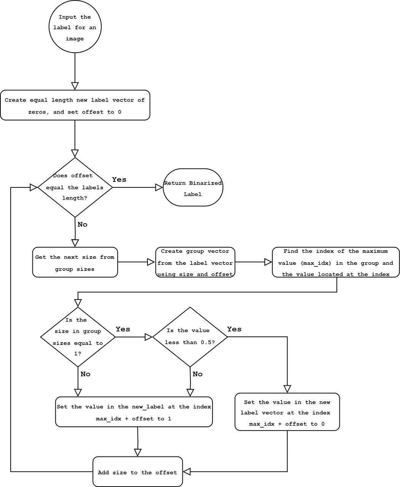
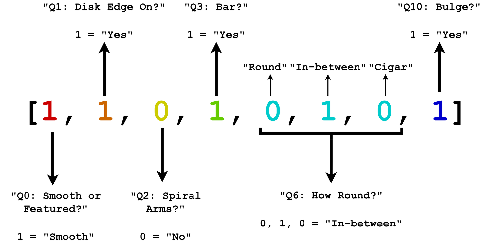
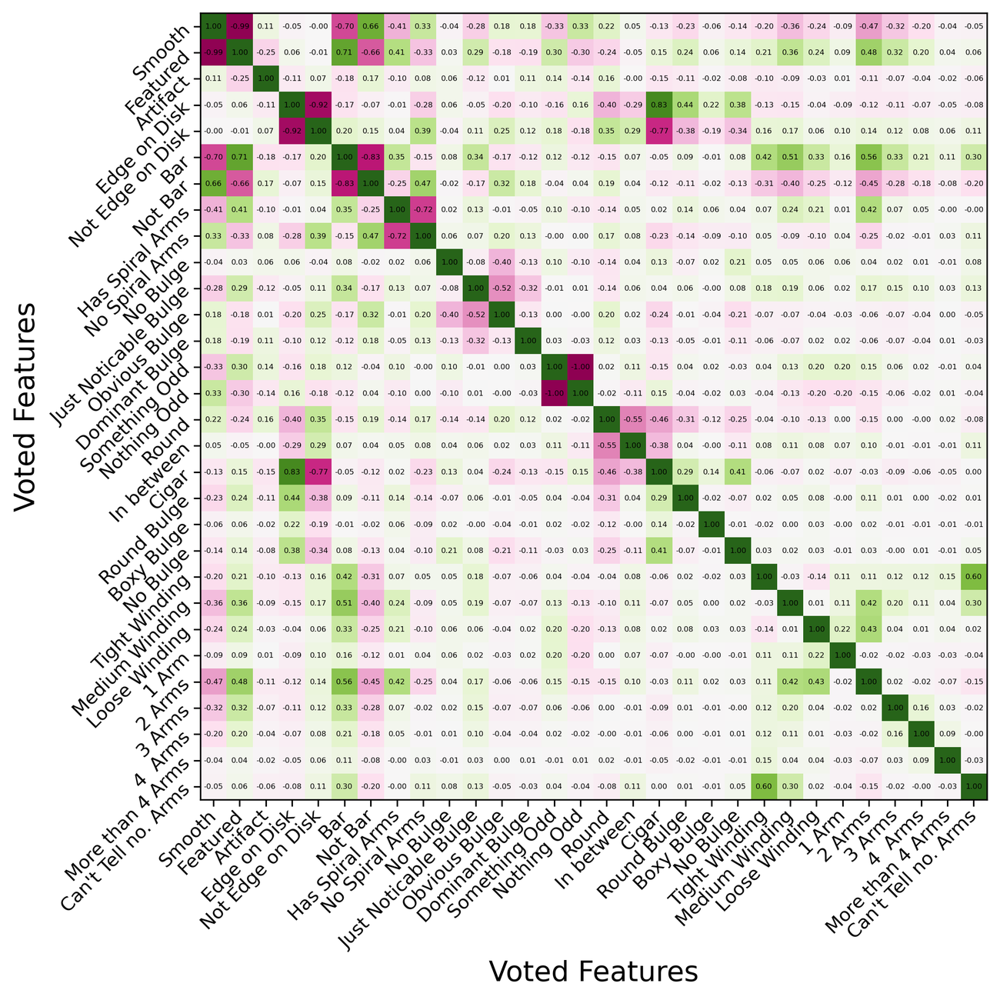

<p align="center">
  
</p>

# **About**

---

Morphological classification of galaxies using the Galaxy Zoo 2 dataset.

This was my final-year project for *PHYS3004* in undergraduate Physics at the University of Nottingham, supervised by Dr Adam Moss and submitted May 2024. It uses transfer learning of deep Convolutional Neural Networks, and Vision Transformer architectures, to test how well a computer vision model can reproduce the morphological classifications made by human volunteers on the Galaxy Zoo &mdash; using those crowdsourced labels as the ground truth.

<p align="center">
  
</p>

<p align="center">
  <em>The galaxies with the highest vote confidence for each morphological feature in the Galaxy Zoo 2 dataset.</em>
</p>

> The models performed to the same ability as the volunteers when identifying morphological features of galaxies, and even replicated the confusion between features exhibited in the crowdsourced labels.

The full write-up lives in [`Classifying_Cosmological_Data_with_Machine_Learning.pdf`](Classifying_Cosmological_Data_with_Machine_Learning.pdf). What follows is a short tour of it.

# **The Problem**

---

Sky surveys such as the Sloan Digital Sky Survey (SDSS) and the Dark Energy Survey (DES) have already catalogued over 400 million galaxies, and projects like the Galaxy Zoo have successfully used crowdsourcing to classify their morphologies. But upcoming surveys make that approach untenable: the Legacy Survey of Space and Time (LSST) alone is expected to produce ~30 TB of imagery *per night*, for a total database of ~150 PB &mdash; with morphological and photometric measurements for billions of galaxies. That is far more than volunteers can ever hope to classify by hand.

Computer vision, a subset of machine learning, is well suited to image classification on datasets of that scale. If the crowdsourced labels are a good enough approximation to the true morphologies, they can be used to train a model that distinguishes between morphological features automatically &mdash; which is what this project sets out to test.

# **The Galaxy Zoo**

---

The Galaxy Zoo is a crowdsourced astronomy project: volunteers are shown an image of a galaxy and answer a branching decision tree of 11 questions (37 possible answers) about it. Galaxy Zoo 2 contributed over 60 million classifications across more than 250,000 galaxies.

<p align="center">
  
</p>

<p align="center">
  <em>The Galaxy Zoo 2 decision tree (by C. Krawczyk) &mdash; 11 questions, 37 answers, colour-coded by tier. The branch you reach depends on earlier answers: a smooth elliptical never reaches the questions about spiral-arm count.</em>
</p>

The dataset used here is the [`galaxy-datasets`](https://pypi.org/project/galaxy-datasets/) build &mdash; over 200,000 JPGs at 424&times;424px, 8-bit RGB, each centred on its target galaxy &mdash; with crowdsourced vote fractions for every feature. This version simplifies the tree slightly by dropping its final question, *"Is the odd feature a ring, or is the galaxy disturbed or irregular?"*.

# **Labels & Classification Schemes**

---

The raw Galaxy Zoo 2 labels are *vote fractions* &mdash; the proportion of volunteers who selected each answer. Rather than regressing to those continuous values (a galaxy either is a spiral or it isn't; a "70% spiral" label is meaningless), each label is binarised to present/absent: within a question group the highest-voted answer becomes 1 and the rest 0, with the whole group zeroed if even the winner falls below 0.5.

<p align="center">
  
</p>

<p align="center">
  <em>The logic of the <code>__to_binary</code> method (the <code>DataFrame</code> class in <code>dataframe.py</code>).</em>
</p>

For mutually-exclusive two-answer questions (e.g. *Smooth* vs *Featured*) the second label is redundant and dropped, cutting the maximum label dimensionality from 32 to 21.

<p align="center">
  
</p>

<p align="center">
  <em>A binarised label under the <em>Reduced Set</em> scheme, decomposed into its constituent questions and features.</em>
</p>

Three classification schemes trade label complexity for coverage:

| Scheme | Questions used | Labels |
| --- | --- | --- |
| *Hubble* | Q0, Q2, Q3, Q10 | Smooth, Spiral Arms, Bar, Bulge Present |
| *Reduced Set* | Q0, Q1, Q2, Q3, Q6, Q10 | + Disk Edge-On, Roundness |
| *All Features* | Q0&ndash;Q4, Q6&ndash;Q10 | Full set (21 binary outputs) |

The full question-to-label mapping:

| Q | Question | Labels used |
| --- | --- | --- |
| Q0 | Smooth or Featured? | `Smooth` |
| Q1 | Could this be a disk viewed edge-on? | `Yes` |
| Q2 | Is there a sign of a spiral arm pattern? | `Yes` |
| Q3 | Is there a sign of a bar feature? | `Yes` |
| Q4 | How prominent is the central bulge? | `Dominant`, `Obvious`, `Just Noticeable` |
| Q6 | How rounded is it? | `Round`, `In-between`, `Cigar` |
| Q7 | Does the galaxy have a bulge? If so, what shape? | `Round` |
| Q8 | How tightly wound do the spiral arms appear? | `Tight`, `Medium`, `Loose` |
| Q9 | How many spiral arms are there? | `1`, `2`, `3`, `4`, `4+`, `Can't Tell` |
| Q10 | Is there a central bulge? *(constructed)* | `Yes` |

Q10 is a derived label not present in the original dataset, constructed from the average of the `bulge-size-gz2 no` and `bulge-shape-gz2 no-bulge` fractions to give an explicit bulge-presence signal. (Q5, *"Is there anything odd?"*, was dropped: it collapses seven visually unrelated features into a single yes/no.)

# **The Catch: Label Correlations**

---

A model trained on volunteer labels can only ever be as good as those labels &mdash; so before training, the correlation structure of the votes was analysed.

<p align="center">
  
</p>

<p align="center">
  <em>Correlation matrix across the voted features. Strong negative correlations mark mutually-exclusive answers (expected); the surprises are off-diagonal &mdash; e.g. "Edge on Disk" &harr; "Cigar", where volunteers couldn't separate a cigar-shaped elliptical from an edge-on disk.</em>
</p>

Broken out per question, the pattern is starker:

<p align="center">
  
</p>

<p align="center">
  <em>Per-question matrices. "Edge on Disk?", "Bar?", "Has Spiral Arms?" and "Something Odd?" behave as expected &mdash; clean negative correlations. But "Bulge Shape?", "Spiral Winding?" and "Spiral Arm Count?" show almost no structure: the volunteers couldn't reliably agree on these features at all.</em>
</p>

The expectation going in was that the network would learn the well-separated questions and struggle on the ambiguous ones &mdash; and that is essentially what happened.

# **Method**

---

**Cleaning.** The PyPI version of the dataset has its problems &mdash; image files listed in the catalogues but missing from disk, a handful of server "error message" frames, and images with coloured or black streaks across them. These were filtered out (error frames, for example, were caught by checking whether the bottom half of the image is pure black).

**Augmentation.** Galaxies are rotationally symmetric and sit centred in frame, so flips, rotations and small scales/translations produce free extra views without adding ambiguity (scaling and translation were capped at tens of pixels to avoid padding the frame with black or shunting the galaxy off-centre). Each image was expanded into 13 views as a preprocessing step, with lighter on-the-fly augmentation reserved for promising runs to reduce overfitting.

<p align="center">
  
</p>

<p align="center">
  <em>One image (centre) expanded into 12 additional views, each generated by applying several augmentations at random.</em>
</p>

**Cropping.** Cropping was always preferred over resizing, since downscaling destroys information whereas cropping preserves it. The crop window was chosen by averaging 2,000 galaxies and taking the centred bounding box of everything above 8.5% brightness &mdash; 227&times;227px, rounded to 224&times;224 for the CNNs. For the transformers, images were cropped to 256&times;256 so they split cleanly into 256 patches of 16&times;16px.

<p align="center">
  
  &nbsp;&nbsp;&nbsp;
  
</p>

<p align="center">
  <em>Left: the optimal bounding box found from the average of 2,000 galaxies. Right: an image split into 256 patches of 16&times;16px, ready to be fed to a transformer.</em>
</p>

**Class imbalance** was handled with Effective Number of Samples weighting (Cui et al.), which down-weights the diminishing returns of seeing yet another example of a common class.

**Models.** Eight pretrained CNNs &mdash; ResNet50 / ResNet50V2, VGG16 / VGG19, MobileNetV3 Small / Large, Xception and InceptionV3 &mdash; fine-tuned from ImageNet weights, alongside from-scratch Vision Transformer (ViT), Compact Convolutional Transformer (CCT) and Convolutional Vision Transformer (CvT) variants. Each was run against the four classification schemes above.

# **Results**

---

**ResNet50 came out on top**, reaching 93% binary accuracy on the simplest single-question scheme (Q0: *Smooth or Featured?*) and 89.8% on the Reduced Set. CNNs consistently beat the transformer architectures across every scheme.

| Model | Scheme | Binary Accuracy | AUC | F1 |
| --- | --- | --- | --- | --- |
| ResNet50 | Q0 | 0.930 | 0.985 | 0.908 |
| ResNet50 | Reduced Set | 0.898 | 0.959 | 0.448 |
| ResNet50 | All Features | 0.838 | 0.884 | 0.173 |
| Xception | Reduced Set | 0.899 | 0.960 | 0.418 |
| InceptionV3 | Reduced Set | 0.877 | 0.920 | 0.400 |
| ViT | Q0 | 0.889 | 0.962 | 0.859 |
| ViT | Reduced Set | 0.719 | 0.739 | 0.107 |
| CCT | Reduced Set | 0.721 | 0.739 | 0.107 |
| CvT | Reduced Set | 0.720 | 0.740 | 0.107 |

The more telling result is *how* each model failed on the hard questions. The **ViT underfit** &mdash; on the confused questions (Q4, Q6, Q8, Q9) it learned to always predict "no", a trivially correct but uninformative strategy that gave a false-positive rate of exactly zero. **ResNet50** instead settled on the *average optimal answer* for those same questions &mdash; a more balanced failure that reflects the underlying uncertainty in the labels more faithfully.

Crucially, the questions the models struggled with are precisely the ones the volunteers disagreed on. The model confusion is a direct echo of the human confusion, which means the ceiling on performance here is set by the quality of the crowdsourced labels, not by the architecture.

Promising directions left for future work: convolutional transformers (which showed early promise but were cut short by compute), ensemble methods across the per-question models, higher-resolution imagery, and instance segmentation to isolate the target galaxy from confusing background sources.

# **Dependencies**

---

The quickest way in is the included **dev container** (`.devcontainer/`) &mdash; open the repo in VS Code or a Codespace and *Reopen in Container*, and it builds a Python 3.10 environment with [uv](https://docs.astral.sh/uv/) and installs everything from `requirements.txt`.

To set it up locally instead:

```
uv venv && uv pip install -r requirements.txt
```

The stack is TensorFlow / Keras 3 for the models, the usual scientific Python tooling (NumPy, SciPy, pandas, scikit-learn, Matplotlib) for processing and metrics, and Pillow / pyarrow / fastparquet for the images and Galaxy Zoo 2 catalogue files. The original Apple-Silicon conda environment is preserved in `projectenv.yaml`; `requirements.txt` is the portable equivalent, pinned to the exact versions used for the project (the Mac-only `tensorflow-macos` / `tensorflow-metal` wheels are gated to macOS, so the Linux container uses the standard `tensorflow` wheel &mdash; see the file for the NVIDIA GPU note).

> The Galaxy Zoo 2 images were originally fetched with the [`galaxy-datasets`](https://pypi.org/project/galaxy-datasets/) module.

# **Usage**

---

**Obtaining the dataset.** The Galaxy Zoo 2 images come from the [`galaxy-datasets`](https://pypi.org/project/galaxy-datasets/) module (or the [Kaggle Galaxy Zoo challenge](https://www.kaggle.com/c/galaxy-zoo-the-galaxy-challenge/data)). Place the image archive and label catalogues in a `data/` directory at the project root.

**Preprocessing** (`image_preprocessing/`) cleans, crops, augments and binarises the cutouts and their labels; the target resolution, augmentation strategy and classification scheme are all configurable.

**Training** (`main/`) is driven by variables at the top of each script (batch size, learning rate, epochs, architecture, scheme). TensorBoard logs and checkpoints are written automatically:

```
tensorboard --logdir logs/
```

**Evaluation & visualisation** (`visualisation/`) runs on the held-out test split and produces the confusion matrices, per-class accuracy breakdowns and sample prediction grids.

# **Repository**

---

| Path | Contents |
| --- | --- |
| `image_preprocessing/` | Dataset cleaning, label binarisation and the augmentation pipeline (incl. `cleandataset.py`, `dataframe.py`) |
| `main/` | Model definitions, training and evaluation |
| `visualisation/` | Dataset analysis and results plots (the figures above) |
| `clean-up-logs-checkpoints.py` | Housekeeping for training logs and checkpoints |
| `.devcontainer/` | Dev container (Python 3.10 + uv) |
| `requirements.txt` | Python dependencies, installed with uv |
| `projectenv.yaml` | Original Apple-Silicon conda environment |
| `assets/` | Figures used in this README |
| `Classifying_Cosmological_Data_with_Machine_Learning.pdf` | The full project report |

# **Help**

---

**Why does the ViT always predict zero for some features?**

This is a known result, not a bug. For the high-confusion questions (Q4, Q6, Q8, Q9), predicting zero is the loss-minimising move when the labels themselves don't separate the features &mdash; the model is faithfully reflecting the ambiguity in the volunteer votes. See **The Catch** above.

**Why is training slow?**

The dev container is CPU by default. For an NVIDIA GPU host, install `tensorflow[and-cuda]==2.16.1`; the original project used Apple's Metal backend via `tensorflow-metal`. Either way, start with a single-question scheme (e.g. Q0) before the full *All Features* scheme, and trim the number of preprocessed augmentation views to speed things up.

**Where are checkpoints and logs saved?**

Checkpoints go to `checkpoints/` and TensorBoard logs to `logs/` at the project root during training; `clean-up-logs-checkpoints.py` clears them out.

**Where can I read about the methodology in full?**

The full report, [`Classifying_Cosmological_Data_with_Machine_Learning.pdf`](Classifying_Cosmological_Data_with_Machine_Learning.pdf), covers the dataset, architectures, training procedure, label design and results in detail.