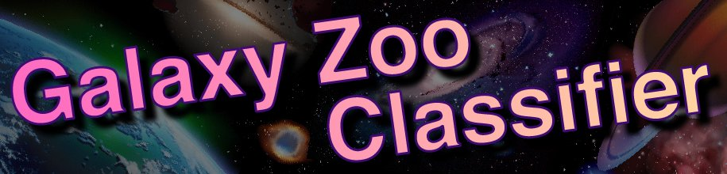
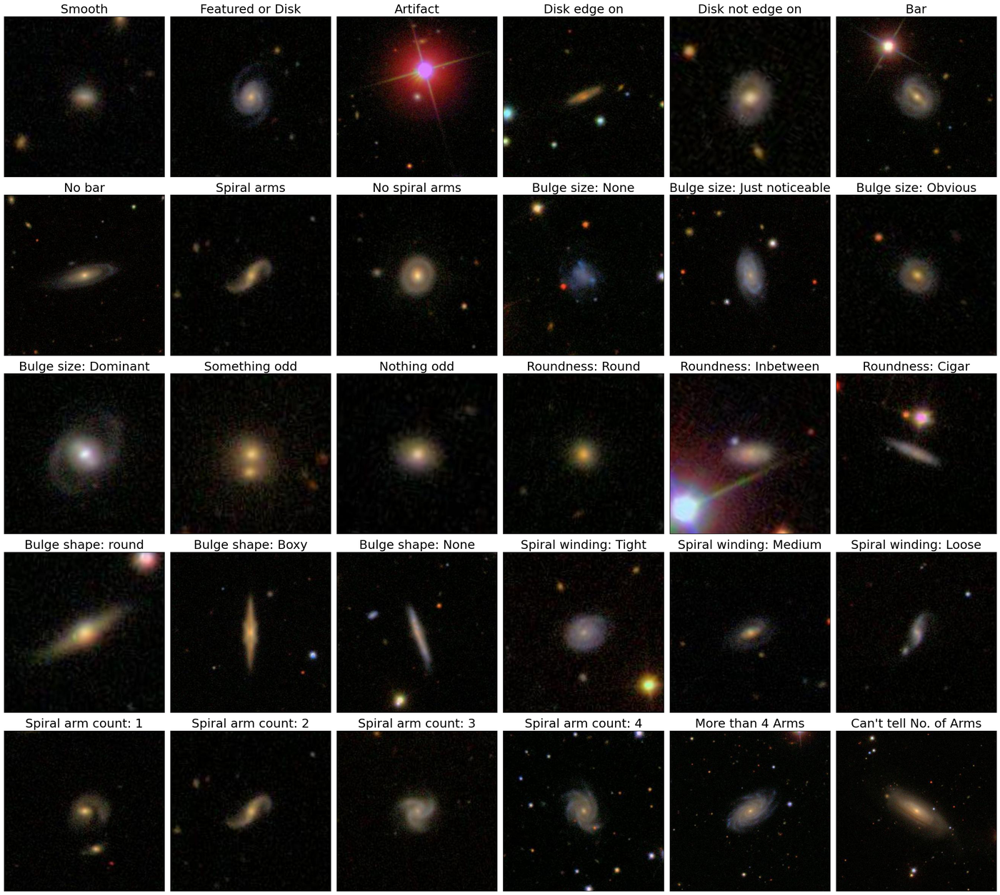
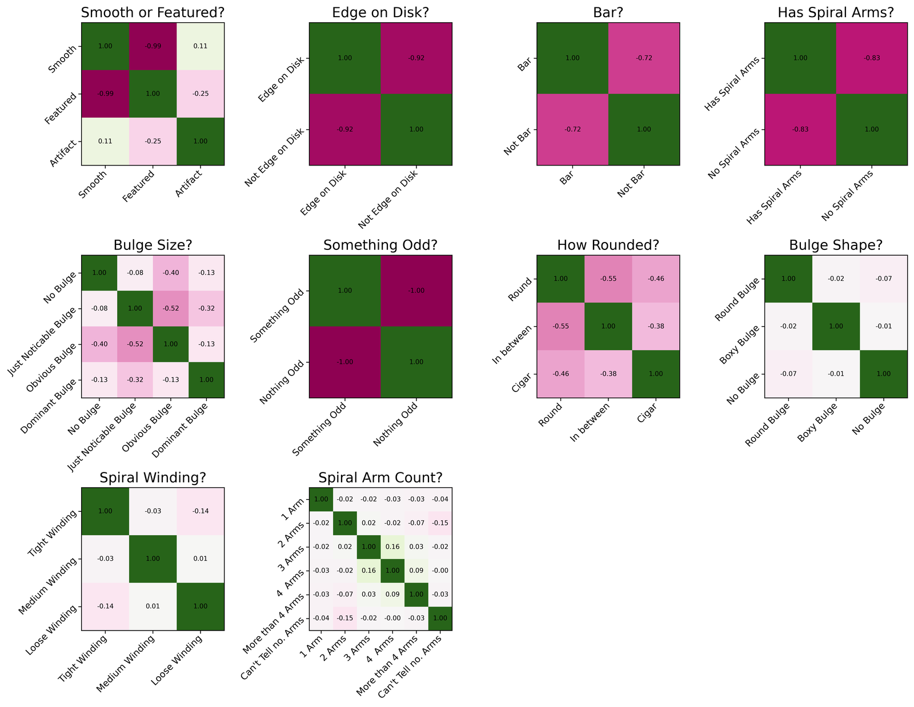
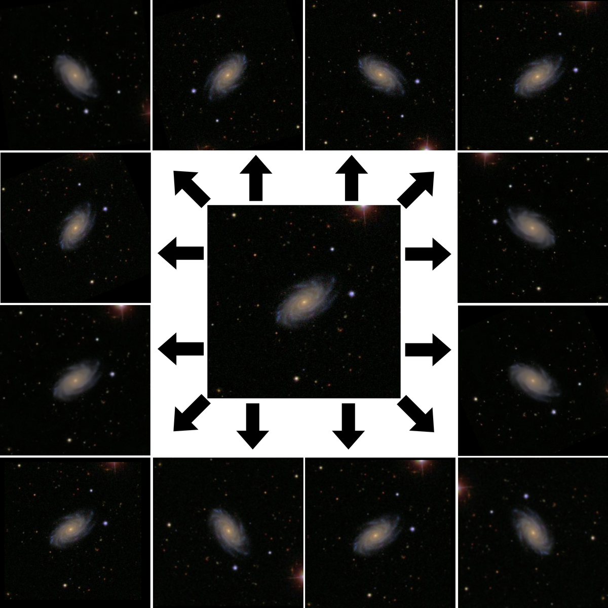
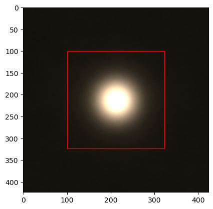
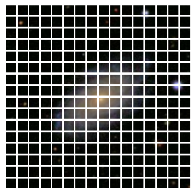

<p align="center">
  
</p>

# **About**

---

Morphological classification of galaxies using the Galaxy Zoo 2 dataset.

This was my final-year project for *PHYS3004* in undergraduate Physics at the University of Nottingham, supervised by Dr Adam Moss. It uses transfer learning of deep Convolutional Neural Networks, and Vision Transformer architectures, to test how well a computer vision model can reproduce the morphological classifications made by human volunteers on the Galaxy Zoo &mdash; using those crowdsourced labels as the ground truth.

The headline result: the models classified morphological features about as well as the volunteers did, and &mdash; more interestingly &mdash; **replicated the same confusions the volunteers exhibited** between features that are genuinely difficult to tell apart.

<p align="center">
  
</p>

<p align="center">
  <em>The galaxies with the highest vote confidence for each of the 37 morphological features in the Galaxy Zoo 2 decision tree.</em>
</p>

The full write-up lives in [`Classifying_Cosmological_Data_with_Machine_Learning.pdf`](Classifying_Cosmological_Data_with_Machine_Learning.pdf). What follows is a short tour of it.

# **The Problem**

---

Sky surveys such as the Sloan Digital Sky Survey (SDSS) and the Dark Energy Survey (DES) have already catalogued over 400 million galaxies, and projects like the Galaxy Zoo have successfully used crowdsourcing to classify their morphologies. But upcoming surveys make that approach untenable: the Legacy Survey of Space and Time (LSST) alone is expected to produce ~30 TB of imagery *per night*, for a total database of ~150 PB &mdash; with morphological and photometric measurements for billions of galaxies. That is far more than volunteers can ever hope to classify by hand.

Computer vision, a subset of machine learning, is well suited to image classification on datasets of that scale. If the crowdsourced labels are a good enough approximation to the true morphologies, they can be used to train a model that distinguishes between morphological features automatically &mdash; which is what this project sets out to test.

# **The Ground Truth**

---

The Galaxy Zoo is a crowdsourced astronomy project: volunteers are shown an image of a galaxy and answer a decision tree of 11 questions (37 possible morphological answers) about it. Galaxy Zoo 2 contributed over 60 million classifications across roughly 250,000 galaxies.

The dataset used here is the [`galaxy-datasets`](https://github.com/mwalmsley/galaxy-datasets) build &mdash; ~200,000 JPGs at 424&times;424px, 8-bit RGB &mdash; with crowdsourced vote fractions for every feature.

**The catch:** a model trained on volunteer labels can only ever be as good as those labels. Plotting the correlations between the voted answers to each question reveals exactly where the volunteers themselves disagreed.

<p align="center">
  
</p>

<p align="center">
  <em>Per-question correlation matrices. "Edge on Disk?", "Bar?", "Has Spiral Arms?" and "Something Odd?" behave as expected &mdash; clean negative correlations between mutually-exclusive answers. But "Bulge Shape?", "Spiral Winding?" and "Spiral Arm Count?" show almost no structure: the volunteers could not reliably agree on these features at all.</em>
</p>

This matters, because any model is going to inherit that confusion. The expectation going in was that the network would learn the well-separated questions reasonably and struggle on the ambiguous ones &mdash; and that is more or less exactly what happened.

# **Method**

---

**Cleaning.** The PyPI version of the dataset has its problems &mdash; image files listed in the catalogues but missing from disk, a handful of "error message" frames, and images with coloured or black streaks across them. These were filtered out (error frames, for example, were caught by checking whether the bottom half of the image is pure black).

**Augmentation.** Galaxies are rotationally symmetric and sit centred in frame, so flips, rotations and small scales/translations produce free extra views without adding ambiguity (scaling and translation were capped at tens of pixels to avoid padding the frame with black or shunting the galaxy off-centre). Each image was expanded into 13 views as a preprocessing step, with lighter on-the-fly augmentation reserved for promising runs to reduce overfitting.

<p align="center">
  
</p>

<p align="center">
  <em>One image (centre) expanded into 12 additional views, each generated by applying several augmentations at random.</em>
</p>

**Cropping.** Cropping was always preferred over resizing, since downscaling destroys information whereas cropping preserves it. The crop window was chosen by averaging 2,000 galaxies and taking the centred bounding box of everything above 8.5% brightness &mdash; 227&times;227px, rounded to 224&times;224 for the CNNs. For the transformers, images were cropped to 256&times;256 so they split cleanly into 256 patches of 16&times;16px.

<p align="center">
  
  &nbsp;&nbsp;&nbsp;
  
</p>

<p align="center">
  <em>Left: the optimal bounding box found from the average of 2,000 galaxies. Right: an image split into 256 patches of 16&times;16px, ready to be fed to a transformer.</em>
</p>

**Labels.** Vote fractions were binarised into present/absent per feature &mdash; a galaxy either is a spiral or it isn't, so a "70% spiral" label is meaningless. Redundant labels were dropped, the rarest and most-confused features removed, and a new synthetic question, *"Is there a central bulge?"*, was constructed. Class imbalance was handled with Effective Number of Samples weighting (Cui et al.), which down-weights the diminishing returns of seeing yet another example of a common class.

**Models.** Eight pretrained CNNs &mdash; ResNet50 / ResNet50V2, VGG16 / VGG19, MobileNetV3 Small / Large, Xception and InceptionV3 &mdash; fine-tuned from ImageNet weights, alongside from-scratch Vision Transformer (ViT), Compact Convolutional Transformer (CCT) and Convolutional Vision Transformer (CvT) variants. Each was run against four classification schemes of increasing difficulty: single-question, Hubble, Reduced Set, and All Features.

# **Results**

---

**ResNet50 came out on top**, consistently beating the Vision Transformer across accuracy, precision and recall. The more telling result is *how* each model failed on the hard questions:

- The **ViT underfit** &mdash; on the confused questions (bulge size and shape, spiral winding, arm count) it learned to always predict "no", giving a false-positive rate of exactly zero while learning nothing meaningful.
- **ResNet50** instead settled on the *average optimal answer* for those same questions &mdash; a more balanced failure, but still a sign of being trapped by the ambiguity in the labels (or stuck in a local minimum of the loss).

Crucially, the questions the models struggled with are precisely the ones the volunteers disagreed on &mdash; the structureless matrices above. The model confusion is a direct echo of the human confusion, which means the ceiling on performance here is set by the quality of the crowdsourced labels, not by the architecture.

Promising directions left for future work: convolutional transformers (which showed early promise but were cut short by compute), ensemble methods across the per-question models, higher-resolution imagery, and instance segmentation to isolate the target galaxy from confusing background sources.

# **Dependencies**

---

The quickest way in is the included **dev container** (`.devcontainer/`) &mdash; open the repo in VS Code or a Codespace and *Reopen in Container*, and it builds a Python 3.10 environment with [uv](https://docs.astral.sh/uv/) and installs everything from `requirements.txt`.

To set it up locally instead:

```
uv venv && uv pip install -r requirements.txt
```

The stack is TensorFlow / Keras 3 for the models, the usual scientific Python tooling (NumPy, SciPy, pandas, scikit-learn, Matplotlib) for processing and metrics, and Pillow / pyarrow / fastparquet for the images and Galaxy Zoo 2 catalogue files. The original Apple-Silicon conda environment is preserved in `projectenv.yaml`; `requirements.txt` is the portable equivalent, pinned to the exact versions used for the project (the Mac-only `tensorflow-macos` / `tensorflow-metal` wheels are gated to macOS, so the Linux container uses the standard `tensorflow` wheel &mdash; see the file for the NVIDIA GPU note).

> The Galaxy Zoo 2 images were originally fetched with the [`galaxy-datasets`](https://github.com/mwalmsley/galaxy-datasets) module.

# **Repository**

---

| Path | Contents |
| --- | --- |
| `image_preprocessing/` | Dataset cleaning, label binarisation and the augmentation pipeline (incl. `cleandataset.py`, `dataframe.py`) |
| `main/` | Model definitions, training and evaluation |
| `visualisation/` | Dataset analysis and results plots (the figures above) |
| `clean-up-logs-checkpoints.py` | Housekeeping for training logs and checkpoints |
| `.devcontainer/` | Dev container (Python 3.10 + uv) |
| `requirements.txt` | Python dependencies, installed with uv |
| `projectenv.yaml` | Original Apple-Silicon conda environment |
| `Classifying_Cosmological_Data_with_Machine_Learning.pdf` | The full project report |
| `Project eDiary.pdf` | Project diary |
